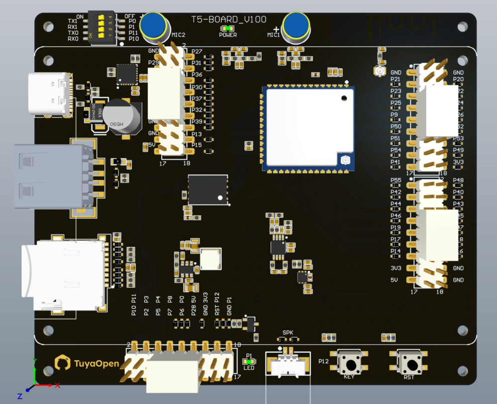
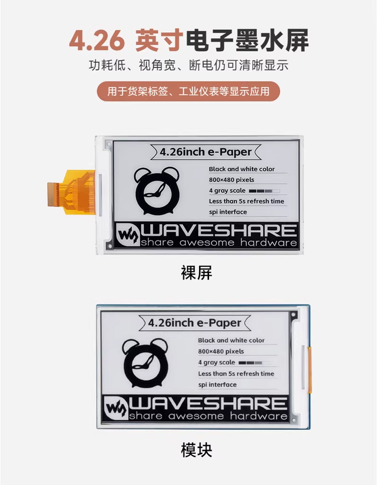
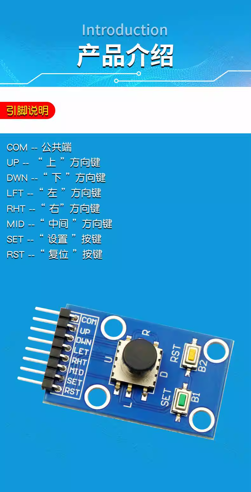
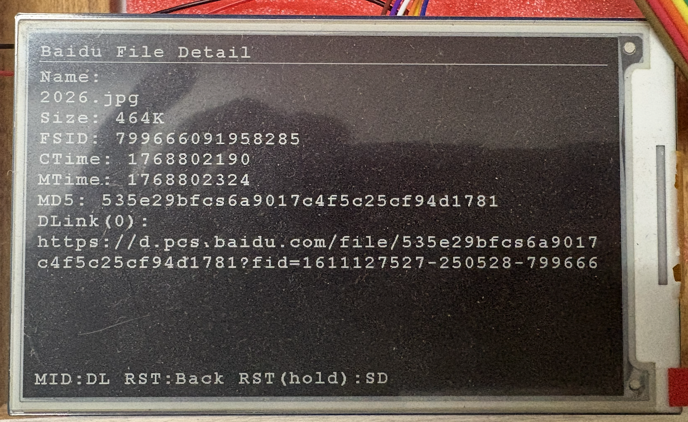

# 墨阅 · E-Paper Reader 文档
---

## 一、简介

墨阅（E-Paper Reader）是基于 TuyaOpen 与涂鸦 T5 平台的轻量级墨水屏阅读演示工程，面向离线阅读与低功耗信息展示场景。项目支持 SD 卡目录浏览、文本分页阅读（断点记录）、图片渲染（1-bit 黑白）、按键交互与启动网络时间同步，并提供百度网盘文件浏览与下载（可选）。

**一分钟了解**
- **面向场景**：离线阅读、资料展示、低功耗信息看板
- **核心能力**：SD 卡目录浏览、文本分页/断点、图片（BMP/JPG/PNG）渲染、旋转与按键控制
- **可扩展点**：编码处理、云端内容（百度网盘）、PDF 预处理、UI/交互优化

**功能一览**
- SD 卡挂载与目录分页浏览
- 文本自动换行与分页（阅读进度保存）
- 图片渲染为 1-bit 黑白图（BMP/JPG/PNG）
- 横竖屏旋转（SET 键切换）
- 启动时联网校时（HTTP Date）
- 百度网盘浏览与下载（可选）

**视频演示**

- [贾-墨阅 · 墨水屏文本图片阅读器](https://www.bilibili.com/video/BV1pjkgB6EiT)
- [涂鸦 4.26 贾-墨阅 · 墨水屏文本图片阅读器_百度网盘下载文本图片到 SD 卡查看](https://www.bilibili.com/video/BV1hhz7BYEAa)
- [贾-墨阅 · 墨水屏文本图片阅读器_百度网盘](https://www.bilibili.com/video/BV1hhz7BYEAa)

---

## 二、硬件

**硬件清单（参考）**
- 主控：涂鸦 T5 平台开发板（示例支持 `TUYA_T5AI_BOARD` / `TUYA_T5AI_POCKET`）
- 显示：4.26 英寸黑白墨水屏（EPD_4in26）
- 存储：Micro SD 卡（FAT32）
- 输入：7 键按键（UP/DOWN/LEFT/RIGHT/MID/SET/RST）
- 供电：USB 供电（可扩展电池方案）

**按键 GPIO 映射（默认）**
- `UP`  → `GPIO27`
- `DOWN` → `GPIO31`
- `LEFT` → `GPIO36`
- `RIGHT` → `GPIO30`
- `MID` → `GPIO37`
- `SET` → `GPIO32`
- `RST` → `GPIO39`

**SD 引脚复用（可选）**
在 `Kconfig` 中开启 `EBABLE_SD_PINMUX` 后，可配置：
- `SD_CLK_PIN` / `SD_CMD_PIN` / `SD_D0_PIN` / `SD_D1_PIN` / `SD_D2_PIN` / `SD_D3_PIN`

**关键硬件说明**
- SD 卡挂载点为 `/sdcard`
- 支持 SD 卡目录浏览与文件读取
- EPD 驱动与绘制接口位于 `lib/e-Paper/` 与 `lib/GUI/`

**硬件实物与模块图（3 张）**





---

## 三、结构 - 复刻教程

> 复刻流程参考立创开源项目页的“结构说明 + 复刻步骤”形式，结合本仓库内容整理。

### 1) 工程结构
```
app_default.config   # 选择板级配置后生成
config/              # 板级配置模板
lib/                 # EPD 驱动/字库/绘制
src/                 # 应用源码
screenshots/         # 截图示例
tools/               # 辅助工具
```

### 2) 复刻准备
- 安装 TuyaOpen 工具链，确保 `tos.py` 可用
- 准备 SD 卡并格式化为 FAT32
- 准备示例文件（txt / jpg / png / bmp）

### 3) 选择板级配置
在 TuyaOpen 工程根目录执行：

```bash
. ./export.sh
cd apps/tuya_t5_epaper_reader

tos.py config choice
```

板级配置模板：
- `config/TUYA_T5AI_BOARD.config`
- `config/TUYA_T5AI_POCKET.config`

### 4) 设备配置（可选）
通过 Kconfig 菜单配置 Wi-Fi 与百度网盘参数：

```bash
tos.py config menu
```

关键配置项：
- `EPAPER_WIFI_SSID` / `EPAPER_WIFI_PSWD`
- `BAIDU_NETDISK_ENABLE`
- `BAIDU_NETDISK_APP_KEY` / `BAIDU_NETDISK_APP_SECRET`
- `BAIDU_NETDISK_TARGET_DIR` / `BAIDU_NETDISK_SCOPE`

### 5) 构建与烧录

```bash
tos.py build
```

将固件烧录到开发板。

### 6) 运行验证
1. 上电自动挂载 `/sdcard` 并显示文件列表
2. 方向键浏览，`MID` 进入目录或打开文件
3. `SET` 切换横竖屏，`RST` 返回
4. （可选）长按 `RST` 进入百度网盘模式

### 7) 目录结构速览
- `src/`：应用源码（UI、文本阅读、图片渲染、网盘）
- `lib/`：EPD 驱动、字库与绘制工具
- `config/`：板级配置参考
- `tools/`：辅助工具（如 PDF 拆页）
- `screenshots/`：示例截图

---

## 四、软件

### 1) 主要功能
- **文件列表**：分页浏览 SD 卡目录
- **文本阅读**：自动换行 / 翻页 / 断点记录
- **图片浏览**：BMP/JPG/JPEG/PNG 渲染为 1-bit 黑白图
- **时间同步**：联网后解析 HTTP Date 校时
- **百度网盘**：授权、列表、详情、下载（可选）

### 2) 使用指南
**按键说明（7 键）**
- `UP / DOWN`：列表移动；阅读时上下滚动
- `LEFT / RIGHT`：列表翻页；阅读时前/后翻页
- `MID`：进入目录 / 打开文件 / 确认
- `SET`：横竖屏切换
- `RST`：返回上一级（长按进入百度网盘）

**文件列表**
- 自动挂载 `/sdcard` 并进入列表
- 分页显示目录内容
- 隐藏目录以 `.` 开头的条目会被忽略

**文本阅读**
- 自动换行与分页
- 支持 UTF-8 / UTF-16 / GBK 识别与显示
- 翻页与滚动：`UP/DOWN` 行滚动、`LEFT/RIGHT` 翻页
- 断点记录：保存到 SD 卡 `/.sd_reader/progress.bin`

**图片浏览**
- 支持 `BMP / JPG / JPEG / PNG`
- 自动按屏幕比例缩放适配
- 渲染为 1-bit 黑白输出

**旋转显示**
- `SET` 切换 0° / 90°
- 文本与图片界面均支持

### 3) 架构与模块
**系统分层**
```
应用层：文件列表 / 文本阅读 / 图片浏览 / 按键交互 / 断点记录 / 旋转
  ↓
TuyaOS / TAL 抽象层：tal_time / tal_kv / event / netmgr / http_client
  ↓
设备驱动：SD/FATFS / GPIO Keys / EPD SPI
  ↓
图形与字库：GUI_Paint / HZK24 GBK
```

**关键模块**
- 应用入口：`src/tuya_main.c`
- 时间同步：`src/net_time_sync.c`
- 图片渲染：`src/sd_image_view.c`
- 百度网盘：`src/baidu_netdisk.c` / `src/baidu_netdisk.h`
- EPD 驱动：`lib/e-Paper/EPD_4in26.*`
- 绘制与字库：`lib/GUI/GUI_Paint.*`、`lib/Fonts/hzk24.*`

**主要路径与文件**
- SD 挂载点：`/sdcard`
- 阅读进度：`/.sd_reader/progress.bin`
- 百度网盘 Token：`/.sd_reader/baidu_token.txt`

### 4) 构建与配置
**Kconfig 关键项**
- `EPAPER_WIFI_SSID` / `EPAPER_WIFI_PSWD`
- `EBABLE_SD_PINMUX` 与 SD 引脚配置
- `BAIDU_NETDISK_ENABLE` / `BAIDU_NETDISK_APP_KEY` / `BAIDU_NETDISK_APP_SECRET`
- `BAIDU_NETDISK_TARGET_DIR` / `BAIDU_NETDISK_SCOPE`

**时间同步**
- 默认使用 HTTP `Date` 头进行校时
- 默认服务器：`www.baidu.com`，路径 `/`
- 时区偏移：`+8`
- 若未成功联网校时，会设置默认时间

**板级配置**
- `config/TUYA_T5AI_BOARD.config`
- `config/TUYA_T5AI_POCKET.config`

**构建命令**
```bash
. ./export.sh
cd apps/tuya_t5_epaper_reader

tos.py config choice
# 可选：tos.py config menu

tos.py build
```

**安全与保密建议**
- `BAIDU_NETDISK_APP_SECRET` 属于敏感信息，建议仅本地配置，不要提交到版本库

### 5) 百度网盘
- 设备码授权（二维码 + 验证码）
- 浏览网盘目录、查看文件详情、下载到 SD 卡
- 进入方式：长按 `RST`
- 默认下载目录：`/sdcard/TuyaT5AI`
- Token 与会话缓存：`/.sd_reader/baidu_token.txt`

### 6) FAQ
- 支持 UTF-8 / UTF-16 / GBK 的基础识别与显示
- 阅读进度保存在 `/.sd_reader/progress.bin`
- 支持 BMP（1-bit/24-bit）、JPG/JPEG、PNG
- 网盘文件默认保存到 `/sdcard/TuyaT5AI`
- 长按 `RST` 进入百度网盘模式

### 7) 排障
- SD 卡未挂载：确认 FAT32、检查 SD Pinmux、查看串口日志
- 列表为空/乱码：隐藏文件会忽略，文件名编码混用需简化
- 图片无法打开：仅支持 BMP/JPG/JPEG/PNG，文件过大可能内存不足
- 时间不正确：需联网校时，未联网将使用默认时间
- 网盘进入失败：确认 Wi-Fi 与 APP_KEY/APP_SECRET 配置

### 8) 参考与工具
**重要源码位置**
- 应用入口与 UI：`src/tuya_main.c`
- 时间同步：`src/net_time_sync.c`
- 图片渲染：`src/sd_image_view.c`
- 百度网盘：`src/baidu_netdisk.c`
- 绘制与字库：`lib/GUI/GUI_Paint.*`、`lib/Fonts/hzk24.*`
- EPD 驱动：`lib/e-Paper/EPD_4in26.*`

**PDF 拆页工具**
文件：`tools/pdf_to_pages.py`

```bash
python3 tools/pdf_to_pages.py /path/to/book.pdf
```

说明：
- 依赖 `pdftoppm`（poppler-utils）
- 输出为 JPG，分辨率 120 DPI，文件名 `0001.jpg` 开始

### 9) 界面与功能截图





